# 基于昇思MindSpore+Orangepi AIpro的训推全流程指导(云端训练+离线推理)

# 1. OrangePi AIpro介绍

目前已实现OrangePi AIpro开发板的系统镜像预置昇思MindSpore AI框架，并在后续版本迭代中持续演进，当前已支持MindSpore官网教程涵盖的全部网络模型。OrangePi AIpro开发板向开发者提供的官方系统镜像有openEuler版本预ubuntu版本，两个镜像版本均已预置昇思MindSpore，便于用户体验软硬协同优化后带来的高效开发体验。同时，欢迎开发者自定义配置MindSpore和CANN运行环境。

接下来的教程将演示如何基于OrangePi AIpro进行自定义环境搭建，如何在OrangePi AIpro启动Jupyter Lab，并**以ResNet50图像分类为例**，介绍OrangePi AIpro上基于MindSpore进行全流程（云端训练+离线推理）运行的步骤。

# 2. 云端训练

图像分类是最基础的计算机视觉应用，属于有监督学习类别，如给定一张图像(猫、狗、飞机、汽车等等)，判断图像所属的类别。本篇将介绍使用ResNet50网络对CIFAR-10数据集进行分类。

## 2.1 环境搭建

**（1）华为云—贵阳一升级MindSpore2.3.1版本**

下载如下链接中的文档，在华为云搭建训练环境：

[华为云ModelArts环境搭建](https://mindspore-courses.obs.cn-north-4.myhuaweicloud.com/orange-pi-mindspore/texts/%E5%8D%8E%E4%B8%BA%E4%BA%91ModelArts%E7%8E%AF%E5%A2%83%E6%90%AD%E5%BB%BA.docx)

下载whl包进行安装，终端运行如下命令：

    wget https://ms-release.obs.cn-north-4.myhuaweicloud.com/2.3.1/MindSpore/unified/aarch64/mindspore-2.3.1-cp39-cp39-linux_aarch64.whl
    # 在终端进入到whl包所在路径，执行pip install命令
    pip install mindspore-2.3.1-cp39-cp39-linux_aarch64.whl

**（2）OrangePi AIpro（香橙派 AIpro）：镜像烧录、升级MindSpore和CANN版本**

具体实现请参考[香橙派开发](https://www.mindspore.cn/docs/zh-CN/master/orange_pi/index.html)中的[环境搭建指南](https://www.mindspore.cn/docs/zh-CN/master/orange_pi/environment_setup.html)部分。

*注：开发板上的MindSpore版本需要与云环境上的版本保持一致；CANN的版本需要与MindSpore的版本相匹配。*

## 2.2 训练代码文档下载

进入MindSpore官网，下载ResNet50案例的notebook文档，链接如下：

https://www.mindspore.cn/tutorials/application/zh-CN/r2.3.0rc2/cv/resnet50.html 

ResNet网络介绍、数据集准备和加载、网络构建、模型训练与评估等都有详细说明。

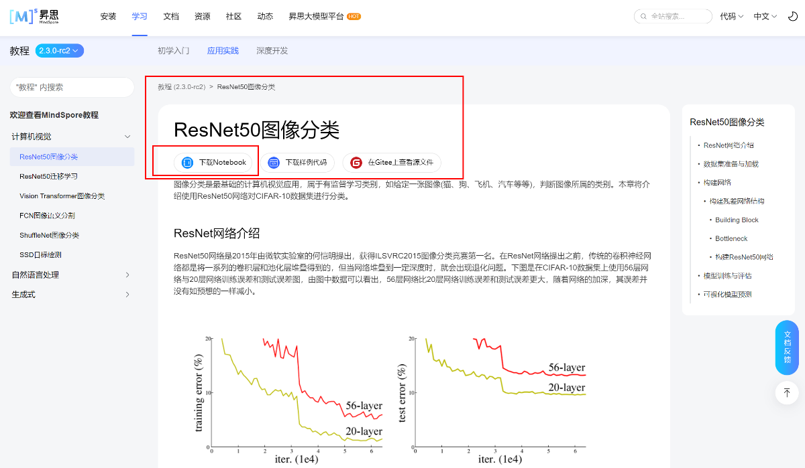

## 2.3 模型训练

将2.2环节下载的训练代码文档上传到ModelArts开发平台。

**训练前修改部分代码：**

**步骤 1** 添加数据下载权限

在数据集准备与加载模块添加数据下载权限

    %env no_proxy='a.test.com,127.0.0.1,2.2.2.2'

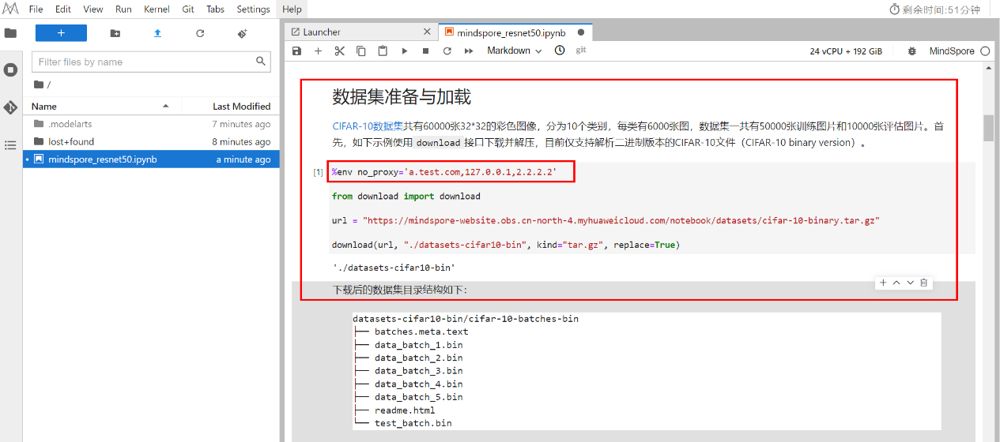

**步骤 2** 添加mindir模型导出代码

在可视化模型预测部分添加导出mindir模型的代码

    Inputs = ms.Tensor(np.ones([4,3,32,32]).astype(np.float32))
    ms.export(net, inputs, file_name= "resnet50", file_format= "MINDIR")

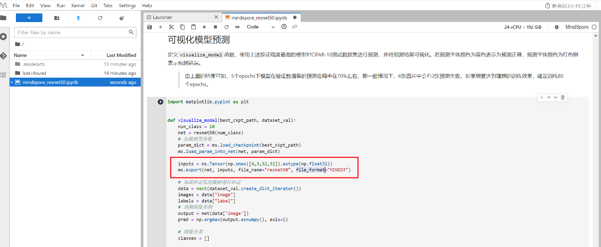

在云环境上运行notebook文档，生成MINDIR模型文件。

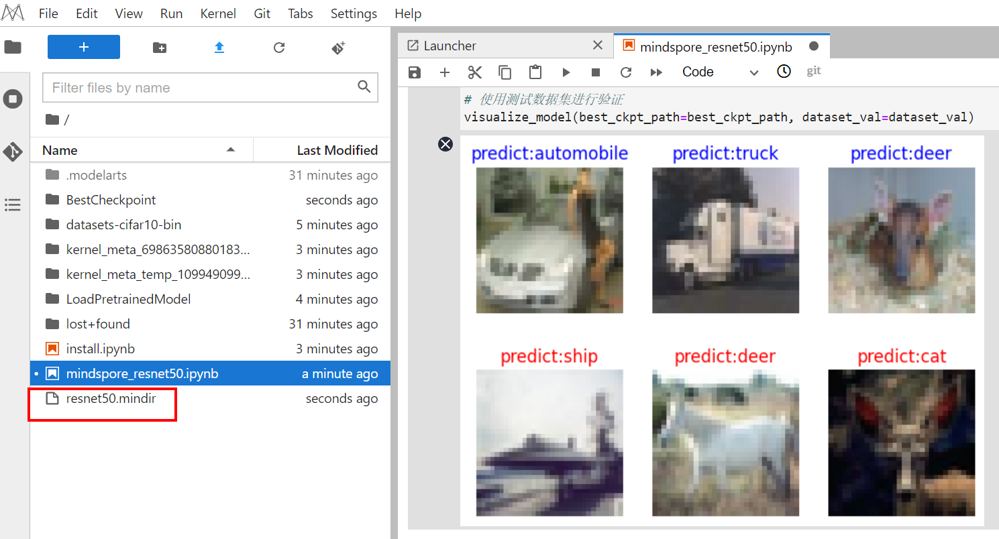

右键下载MINDIR模型文件至本地。

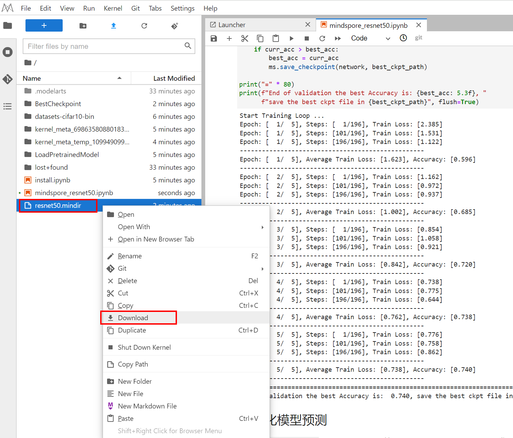

# 3 OrangePi AIpro上离线推理

本环节在香橙派AIpro开发板上，首先进行离线模型转换，使用convert命令将mindir模型转换为om模型，然后使用AscendCL开发推理代码，实现图像分类推理任务。

## 3.1 推理代码文档下载

进入MindSpore版的开发板离线推理代码仓，下载ResNet50的离线推理文件，下载地址如下：

https://github.com/mindspore-courses/orange-pi-mindspore/tree/master/infer/03-ResNet50 

## 3.2 Convert命令获取om模型文件

**步骤 1** 上传mindir模型文件

在“/home/HwHiAiUser/samples/noteboooks”目录下创建ResNet50_2.2.14文件夹，将训练获得的mindir模型文件放入该文件夹。

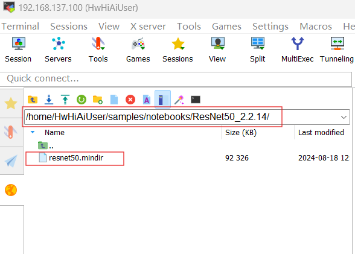

**步骤 2** mindir模型文件转换为om模型

在“/home/HwHiAiUser/samples/noteboooks”目录下运行如下命令，生成om模型文件。

    #获取bash.sh文件
    wget https://mindspore-courses.obs.cn-north-4.myhuaweicloud.com/orange-pi-mindspore/package/bash.sh

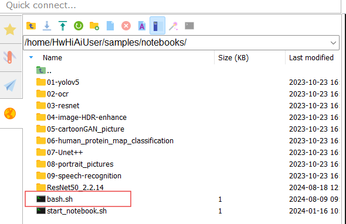

    #执行bash.sh文件
    source bash.sh /home/HwHiAiUser/samples/notebooks/ResNet50_2.2.14/resnet50.mindir resnet50

注：bash.sh文件执行时需要传入两个参数，如上述第二个命令所示：

第一个参数是开发板上存放的MINDIR文件的绝对路径；

第二个参数是生成的om文件的名称；

运行完成后生成的om文件和bash.sh文件同目录。

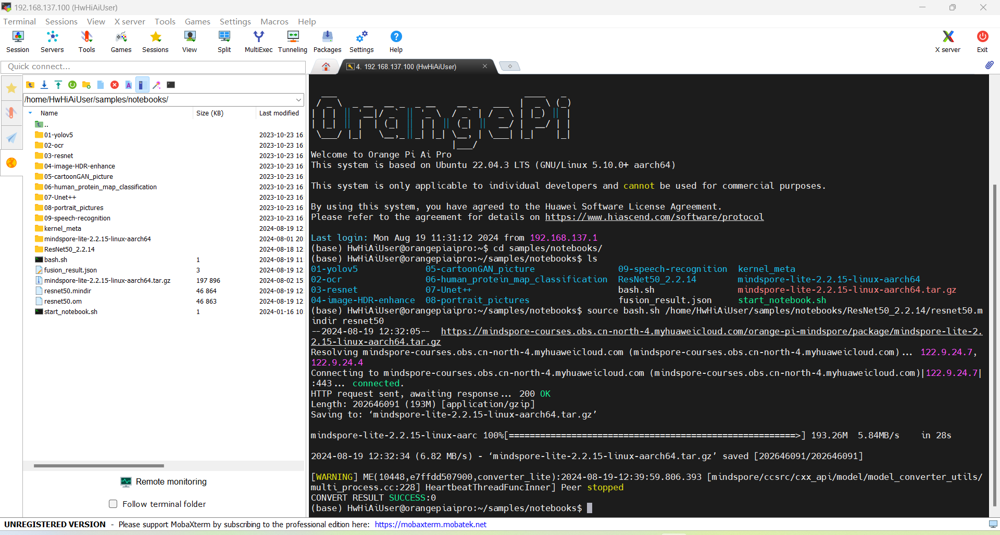

## 3.3 创建推理项目文件夹

在“/home/HwHiAiUser/samples/noteboooks”目录下创建ResNet50文件夹，将3.1下载的推理代码文档放入该文件夹，并在ResNet50文件夹下创建model文件夹，将3.3.1生成的om模型放入model文件夹下。目录如下：

* ResNet50
  * —  model
    * --resnet50.om
  - —  main_resnet50.ipynb

## 3.4 启动notebook运行环境执行推理应用

**步骤 1** 运行start_notebook.sh文件

使用如下命令运行start_notebook.sh文件

    ./start_notebook.sh

打开notebook运行环境，可以看到创建的ResNet50项目文件夹。

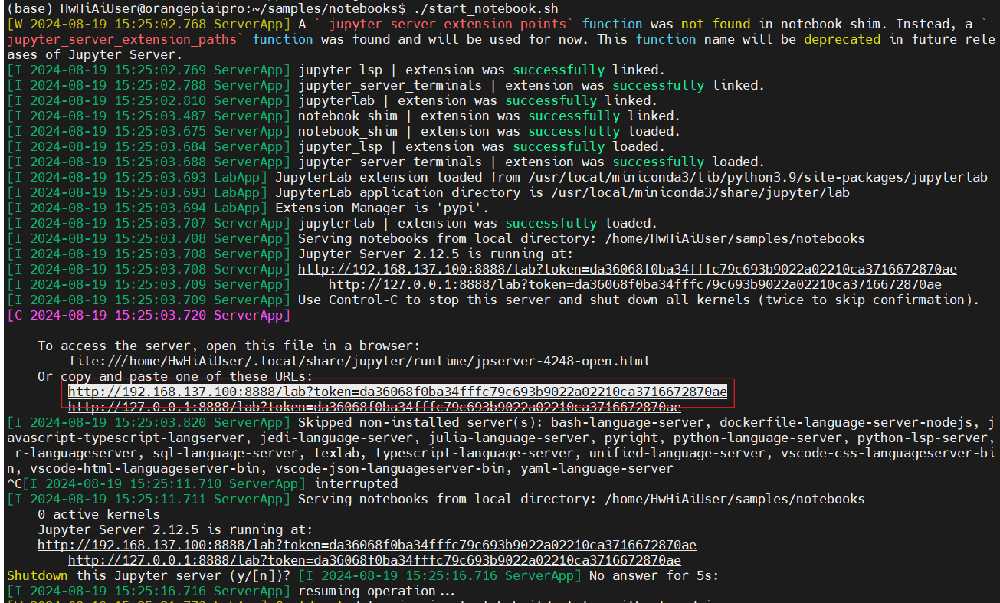

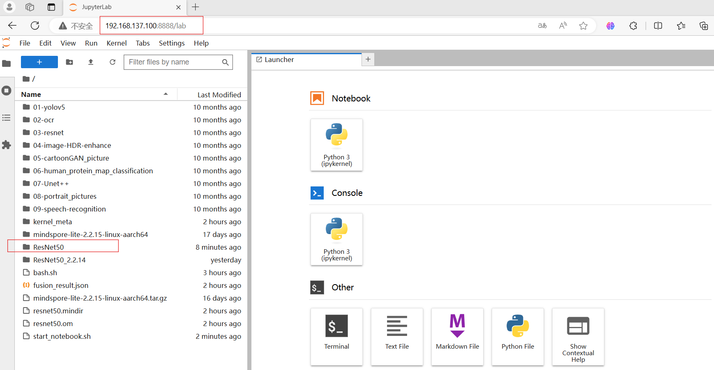

**步骤 2** 修改推理代码

打开main_resnet50.ipynb文档，在下载环节，注释掉om文件下载的代码，保留数据集下载的代码。

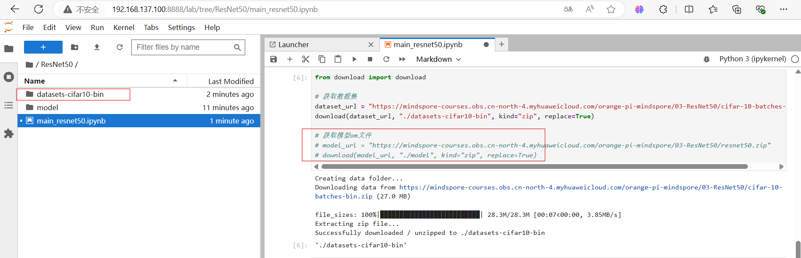

**步骤 3** 执行推理应用

运行main_resnet50.ipynb文档，进行图像分类推理应用。

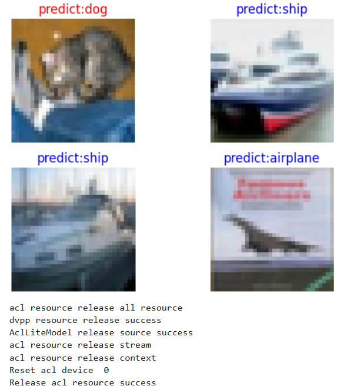

**实验总结**

本实验实现基于MindSpore的ResNet50图像分类离线推理全流程实践。训练环节，首先基于MindSpore框架搭建ResNet50模型，完成代码开发，然后在华为云ModelArts平台(昇腾910芯片算力)，使用cifar-10数据集完成模型训练，获得mindir模型文件。推理环节，在香橙派AIpro开发板上，首先进行离线模型转换，使用convert命令将mindir模型转换为om模型，然后使用AscendCL开发推理代码，实现图像分类推理任务。

# 4 更多案例

**更多基于MindSpore框架开发的全流程实验指导文档详见[orange-pi-mindspore](https://github.com/mindspore-courses/orange-pi-mindspore/tree/master/infer)中的[基于昇思MindSpore+Orangepi AIpro的训推全流程指导书(离线推理)](https://github.com/mindspore-courses/orange-pi-mindspore/tree/master/Offline/%E5%9F%BA%E4%BA%8E%E6%98%87%E6%80%9DMindSpore%2BOrangepi%20AIpro%E7%9A%84%E8%AE%AD%E6%8E%A8%E5%85%A8%E6%B5%81%E7%A8%8B%E6%8C%87%E5%AF%BC%E4%B9%A6(%E7%A6%BB%E7%BA%BF%E6%8E%A8%E7%90%86))**
