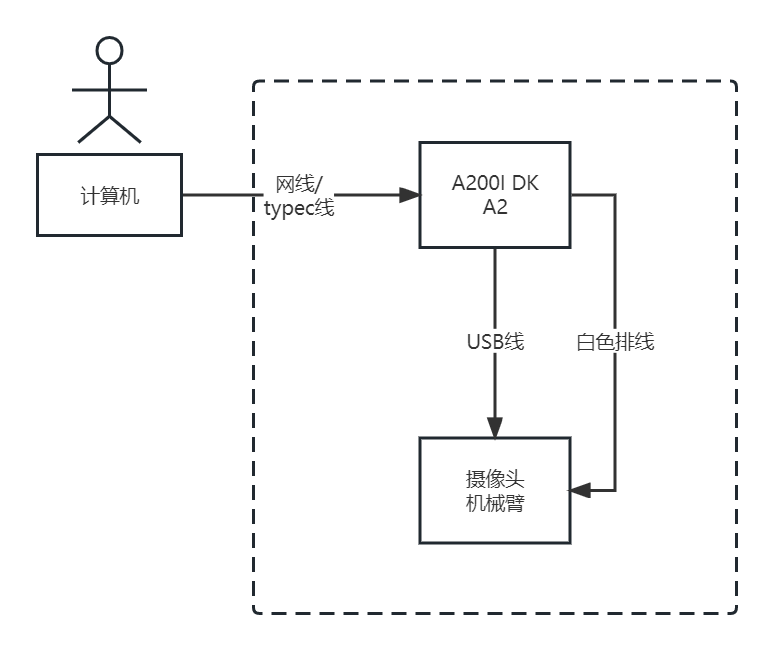
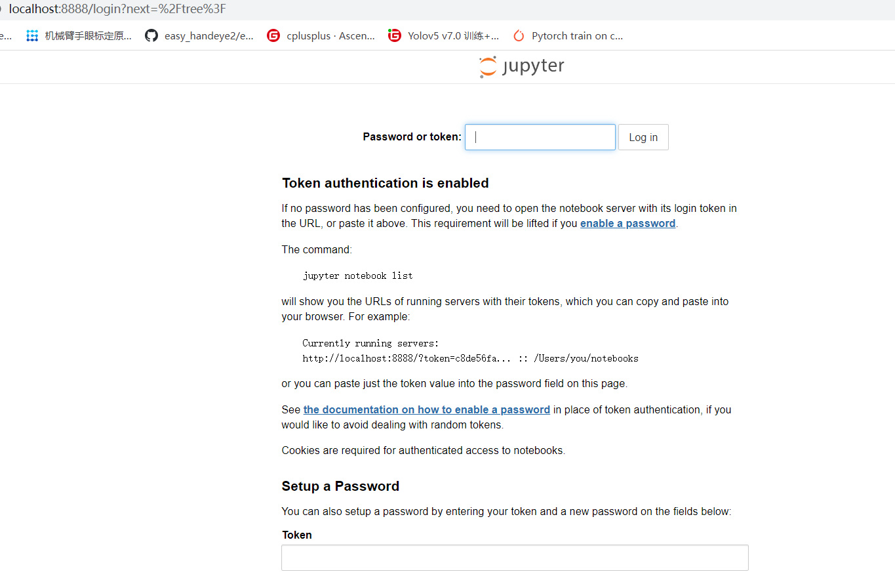
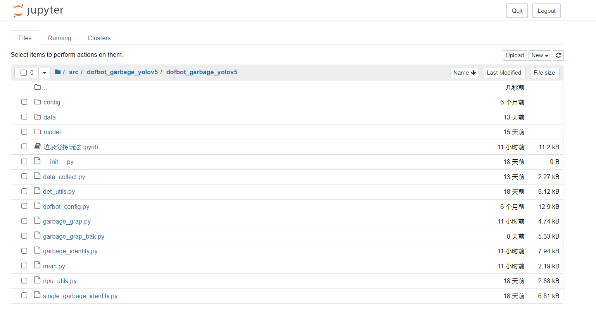
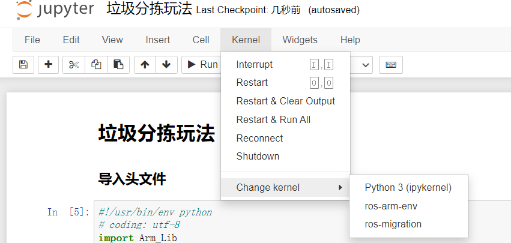
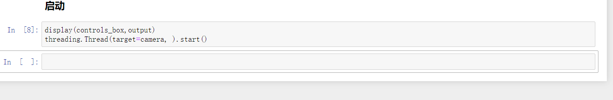
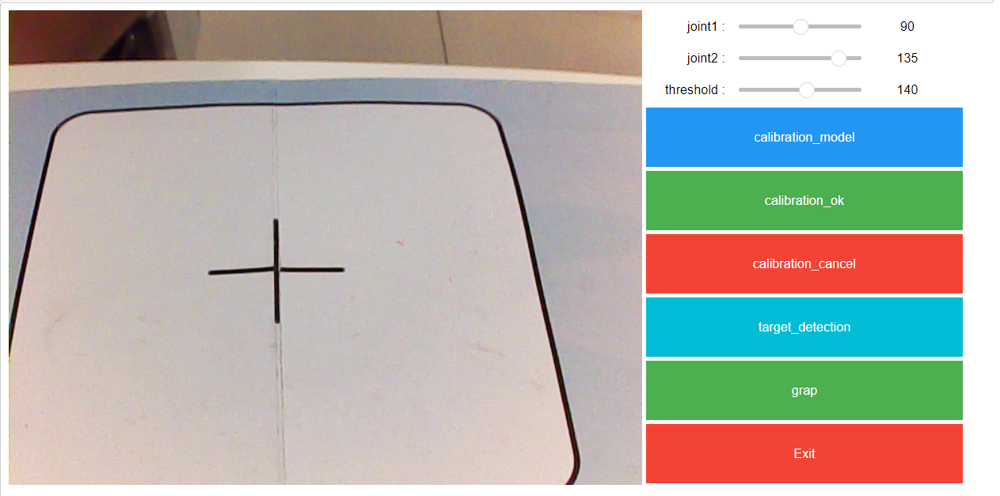
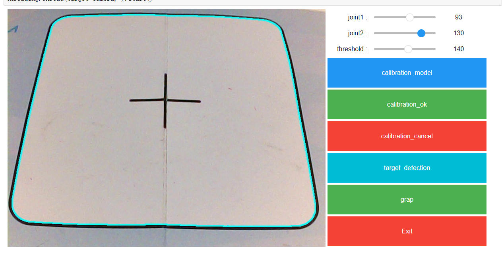
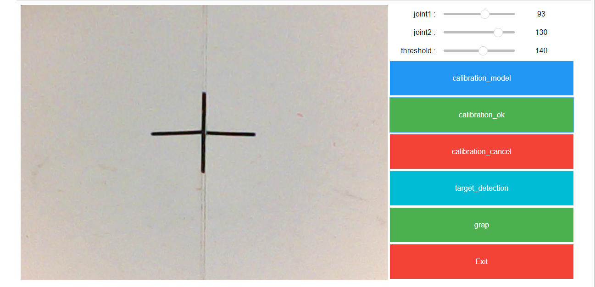
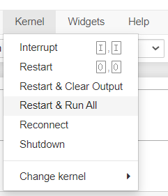

[toc]

## 开发测试

本代码为基于原本200DK A2昇腾om推理的机械臂代码上，在香橙派ai pro上适配了使用mindspore lite推理yolov5s模型实现机械臂的不同颜色小方块分拣功能，目前所测试运行的环境为香橙派ai pro 20t, 使用的镜像是香橙派官方的opiaipro_20t_ubuntu22.04_desktop_aarch64_20250211.img.xz, cann版本为8.0(镜像自带，不用重新安装)，mindspore和mindspore lite版本为2.6,需要手动用pip命令安装

## 模型说明
本样例代码中使用了yolov5s模型，模型文件在本仓库的ros2_ws\src\dofbot_garbage_yolov5\dofbot_garbage_yolov5\model\目录下，yolov5s_lite_ros.mindir文件为mindspore lite在香橙派的ai pro 20t的310b环境下的推理文件

##自己训练模型说明
如果准备自己体验模型训练的过程，需要先用机械比的摄像头拍摄100张以上680*480分别率的小方块图片，有红绿蓝3种颜色的小方块，然后使用昇腾的工具进行标注，工具链接如下：
https://www.hiascend.com/document/detail/zh/Atlas200IDKA2DeveloperKit/23.0.RC2/Getting%20Started%20with%20Application%20Development/iaqd/iaqd_0007.html

标注完成后可以使用mindyolo套件进行训练，可以在mindspore 2.6 310P环境训练（目前我这边用来训练的环境），训练前需要把标注的格式转成yolo格式，mindYolo套件参考：
https://github.com/mindspore-lab/mindyolo
也可以直接用上述标注的昇腾工具进行训练，不过训练过程是使用CPU的，速度会慢一些，昇腾工具训练最终得到的是一个onnx文件；

最后参考mindyolo的lite部署文档进行在ai pro上模型导出和转换：
https://github.com/mindspore-lab/mindyolo/tree/master/deploy

注：使用mindyolo训练模型后得到的是ckpt文件，然后根据上述文档导出为mindir格式，然后再用lite工具转成lite专用的mindir文件（后缀还是mindir，但转换后可以加快启动速度）；如果是用的昇腾工具训练的，就直接用lite工具把onnx文件转成lite专用的mindir文件；

获取到lite专用mindir文件后，放置到ros2_ws\src\dofbot_garbage_yolov5\dofbot_garbage_yolov5\model\目录下即可，即上述的yolov5s_lite_ros.mindir文件

## aipro环境准备

准备环境中，下载代码和安装依赖都需要联网，香橙派ai pro支持网线连接路由器，或者usb连接电脑联网，或者wifi联网；

关于机械臂组装的操作，可以参考以下昇腾文档：
https://www.hiascend.com/document/detail/zh/Atlas200IDKA2DeveloperKit/23.0.RC2/Application%20Cases/raadg/raadg_0002.html
该文档中使用的开发板是200DK A2,但机械臂的组装方法是一样的

### 下载代码

默认用root账户运行，香橙派的镜像中cann环境默认都配置在root账户下，如果切换其他账户，可能需要重新设置环境变量；
将本仓库的代码目录下载到/root目录下面，如果是其它目录的话，会出现urdf文件读取不到的问题，原因是ROS的CPP代码中把路径写死在了里面，如果需要用其它目录，可以参考以下链接进行修改：
https://developer.huawei.com/home/forum/ascend/thread-0297149164470390076-1-1.html

### 预备步骤

确保ai pro联网。

在`~/.bashrc`文件末尾新增一行：`conda deactivate`（**注：不用机械臂时，请自行将这一行注释掉**），随后保存并退出`~/.bashrc`文件，在命令行中输入`source ~/.bashrc`  

使用链接（[https://ascend-repo.obs.cn-east-2.myhuaweicloud.com/Atlas%20200I%20DK%20A2/DevKit/samples/23.0.RC1/e2e-samples/Arm/robot_arm_dependency.zip]）下载依赖压缩文件，将该压缩文件放入`ros2_robot_arm`文件夹中。使用`unzip robot_arm_dependency.zip`命令对依赖文件压缩包进行解压。

### 安装ROS

请按照顺序依次执行如下命令：  
1. `sudo apt install -y software-properties-common`  
2. `sudo curl -sSL https://raw.githubusercontent.com/ros/rosdistro/master/ros.key -o /usr/share/keyrings/ros-archive-keyring.gpg`（**本条命令将尝试访问github，如遇卡顿，请多尝试几次**）  
3. `echo "deb [arch=$(dpkg --print-architecture) signed-by=/usr/share/keyrings/ros-archive-keyring.gpg] http://packages.ros.org/ros2/ubuntu $(. /etc/os-release && echo $UBUNTU_CODENAME) main" | sudo tee /etc/apt/sources.list.d/ros2.list > /dev/null`  
4. `sudo apt update`  
5. `sudo apt install -y libegl-mesa0`  
6. `sudo apt install -y ros-humble-desktop`  
7. `sudo apt install -y python3-colcon-common-extensions`  
8. `sudo apt install -y pip`  

### 安装mindspore 2.6和mindspore lite 2.6云测python包

请按照顺序依次执行如下命令：  
1. `pip3 install https://ms-release.obs.cn-north-4.myhuaweicloud.com/2.6.0/MindSpore/unified/aarch64/mindspore-2.6.0-cp310-cp310-linux_aarch64.whl --trusted-host ms-release.obs.cn-north-4.myhuaweicloud.com -i https://pypi.tuna.tsinghua.edu.cn/simple`  
2. `pip3 install https://ms-release.obs.cn-north-4.myhuaweicloud.com/2.6.0/MindSpore/lite/release/linux/aarch64/cloud_fusion/python310/mindspore_lite-2.6.0-cp310-cp310-linux_aarch64.whl -i https://pypi.tuna.tsinghua.edu.cn/simple`  
3. `pip3 install mindyolo -i https://pypi.tuna.tsinghua.edu.cn/simple`

### 安装其他依赖

进入目录`ros2_robot_arm`，执行如下命令  
1. `pip3 install -r requirements.txt`  
2. `sudo dpkg -i libconsole-bridge0.4_0.4.4+dfsg-1build1_arm64.deb`  
3. `sudo dpkg -i liburdfdom-world_1.0.0-2ubuntu0.1_arm64.deb`  

将如下环境变量添加至`~/.bashrc`文件中  
`LD_LIBRARY_PATH=$LD_LIBRARY_PATH:/usr/lib:/usr/lib/aarch64-linux-gpu:/usr/local/lib`  
随后执行：`source ~/.bashrc`  

将`libdofbot_kinemarics.so`放入`/usr/lib`中：`cp libdofbot_kinemarics.so /usr/lib`

### 安装orocos_kdl

进入目录`ros2_robot_arm`，依次执行如下命令  
1. `cd orocos_kdl && mkdir build && cd build`  
2. `cmake ..`  
3. `make -j4`  
4. `sudo make install`  

### 安装机械臂底层驱动

进入目录`ros2_robot_arm`，执行如下命令  
1. `cd 0.py_install`  
2. `python3 setup.py install`  

### 编译工作空间

进入目录`ros2_robot_arm`，  
1. `. setenv.sh`，执行完出现提示信息：`-bash: ./ros2_ws/install/setup.bash: No such file or directory`，忽略即可。
2. `cd ros2_ws && colcon build`
3. `source ./install/setup.bash`

## 硬件连接

以ai pro为中心，用网线与计算机相连，用40pin排线与机械臂相连（注意排线的两头都是母头），用USB线与装在机械臂的摄像头相连，并连接电源通电；

硬件示意图：



## 校准摄像头（**该步骤仅供初次使用！后续可跳过此步骤**）

目的：可视化界面调整摄像头位置，确保整个十字框可见

为确保方框无法被摄像头拍摄全的问题，现补充图形化界面。

在原终端的/root/下运行jupyter notebook：`jupyter notebook --allow-root`（如在**MobaXTerm**中启动，则需要添加DK的ip，并在/root目录下运行。实例命令：`jupyter notebook --allow-root --ip 192.168.137.100`）。若生成的其中一个url访问不成功，可以尝试另外一个

**----------注意1：----------**

第一次启动时可能会有输入密码的情况



这个时候，密码在终端中：


将红框部分复制粘贴即可。

**------注意部分结束----------**


在Jupyter notebook中逐级点击进入目录：`/root/ros2_robot_arm/ros2_ws/src/dofbot_garbage_yolov5/tools`，最终进入`相机校准.ipynb`



随后在如下图所示的`Kernel`选择栏中，点击`Restart & Run All`




**----------注意2：----------**

首次启动后，拉到最下方可能不会有任何显示。如下图所示：



此时拉会到最上方并点击`Restart & Run All`即可。多跑几次，直到出现图形界面为止。

**------注意部分结束----------**


出现的图形界面如下：



图形界面使用步骤如下：

1. 点击`calibration_model`，点击后，拉动上方的滚动条（`joint1`和`joint2`），随着滚动条的拉动，蓝色边框会出现，**请务必确保蓝色边框覆盖整个十字框，具体效果如下（请确保测试环境具备充足的灯光！）：**



2. 当效果如上图所示时，点击`calibration_ok`按钮，则可视化界面进入方框内部。具体效果如下图所示：



**----------注意3：----------**

在调整完显示框后，应关闭jupyter notebook的程序，避免与python主程序发生摄像头冲突。建议使用`Restart`命令进行关闭，如下图所示：



**------注意部分结束----------**

回到终端，使用`Ctrl C`命令终止`jupyter notebook`程序

## 启动机械臂单个小方块抓取

开启两个窗口，每个窗口下都执行如下操作，
进入目录`ros2_robot_arm`，
在每个窗口下都执行`. setenv.sh`
在第一个窗口中执行：`ros2 run dofbot_moveit dofbot_server`
在第二个窗口中执行：`ros2 run dofbot_garbage_yolov5 block_cls`


## 对于抓取不准的问题，需针对首次抓取结果，人工修正硬件噪声（**该步骤仅供初次使用！后续可跳过此步骤**）：

经过对比不同机械臂发现，即使是相同商家生产的机械臂，每一款产品在出厂时也存在硬件上的规格差异，俗称噪音，**如果首次存在无法抓取的情况，玩家需要根据自己手中的机械臂手动配置噪声参数**

通过如下命令进入配置文件的目录：

```
cd /root/ros2_robot_arm/ros2_ws/src/dofbot_garbage_yolov5/dofbot_garbage_yolov5/config
```

使用通过`MobaXTerm`或`vim`工具修改`offset.txt`文件，在该txt文件中修改噪音参数：

1. 如发现机械臂抓取略微靠后（色块后方），导致无法抓取，则需要适当加大该参数（如从0.008修正到0.01）
2. 如发现机械臂抓取略靠前（色块前方），导致无法抓取，则需要适当减少该参数（如从0.008修正到0.006）

反复修改该参数，重复该流程，直到合适抓取位置。

随后，将该配置目录下的配置文件`XYT_config.txt`、`dp.bin`、`offset.txt`复制粘贴到如下目录：`/root/ros2_robot_arm/ros2_ws/src/robot_arm_color_stacking/robot_arm_color_stacking/config`中。使得下一步骤的堆叠功能，共享当前的配置
