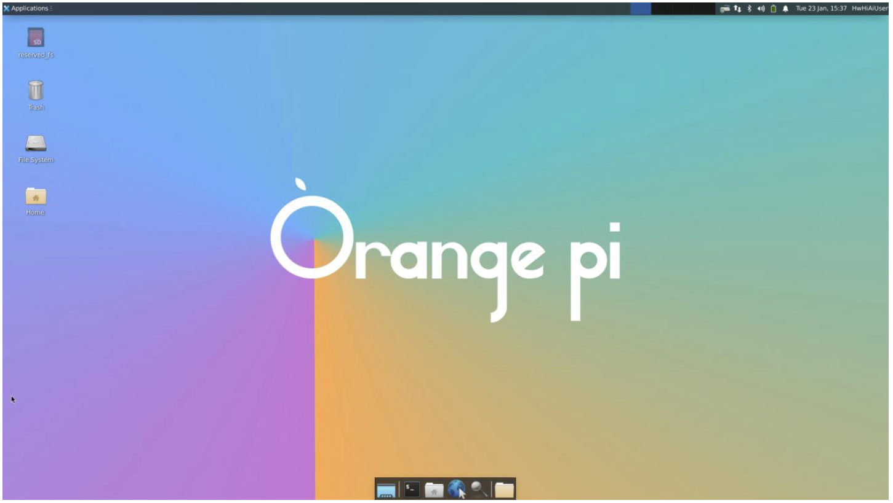
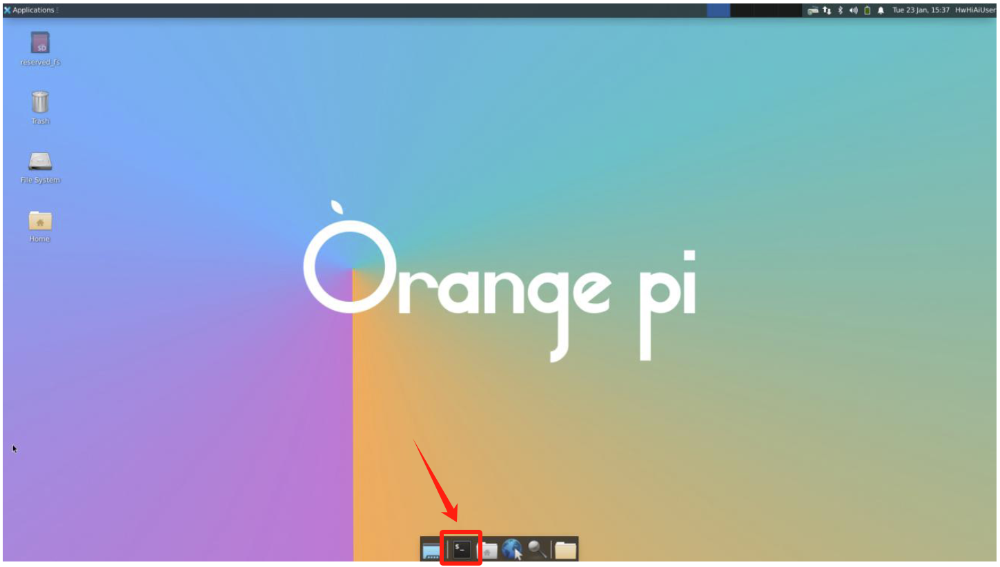
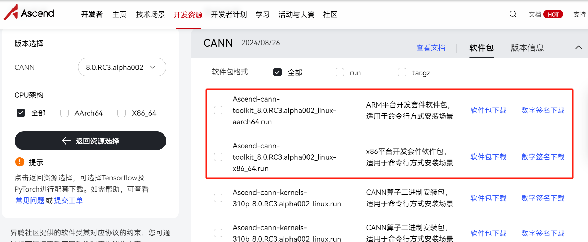
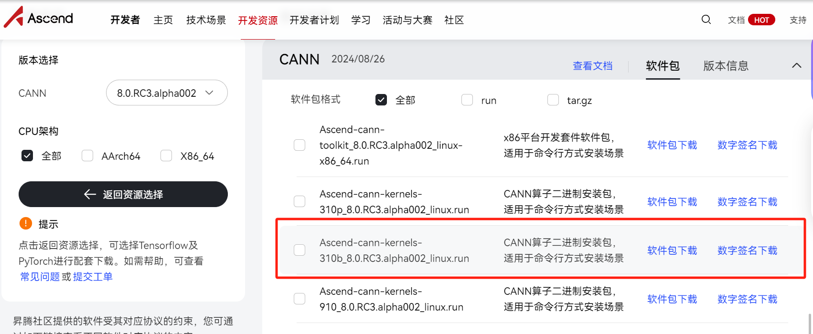
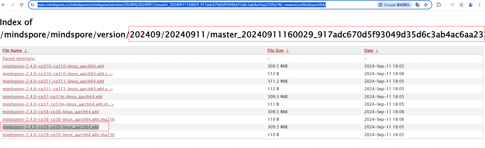
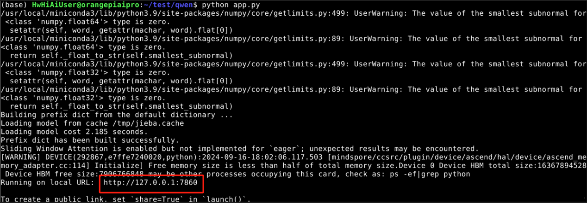
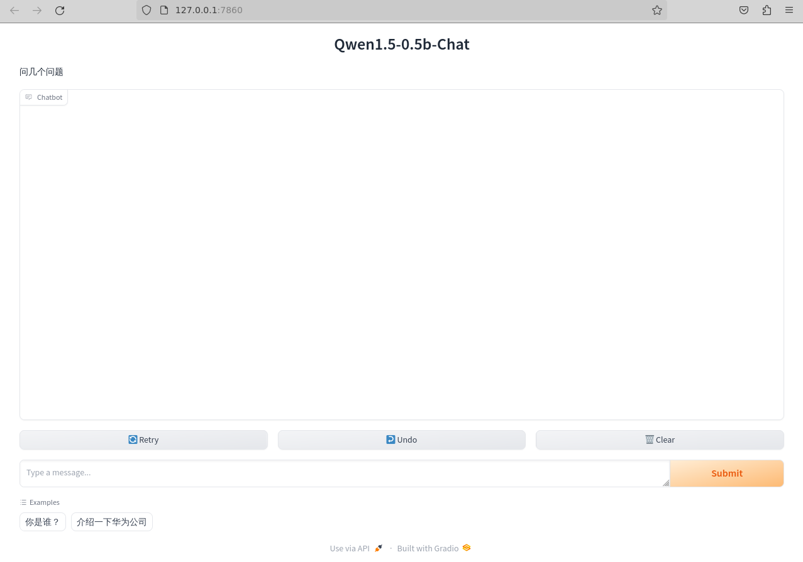
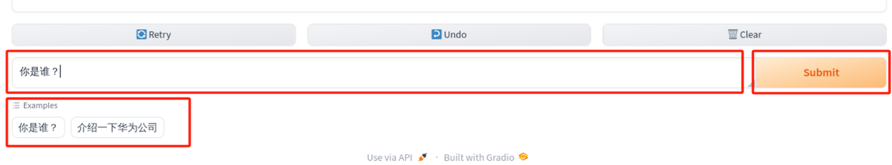

# 基于昇思MindSpore的香橙派开发板聊天机器人 - 体验操作文档
## 1.	昇思MindSpore介绍
昇思MindSpore是一个全场景深度学习框架，旨在实现易开发、高效执行、全场景统一部署三大目标。其中，易开发表现为API友好、调试难度低；高效执行包括计算效率、数据预处理效率和分布式训练效率；全场景则指框架同时支持云、边缘以及端侧场景。更多详情可以查看官方网址：https://www.mindspore.cn/
## 2.	MindSpore NLP套件介绍
MindSpore NLP是基于MindSpore的一个自然语言处理大模型套件，其中包含了许多自然语言处理的常用方法，提供了一个易用的NLP平台，旨在帮助研究人员和开发者更高效地构建和训练模型。感兴趣的同学可以点击访问我们的开源代码仓库和文档：
-	代码仓：https://github.com/mindspore-lab/mindnlp
-	文档：https://mindnlp.cqu.ai/zh/
## 3.	OrangePi AIpro香橙派开发板介绍
OrangePi AIpro 采用昇腾AI技术，搭载4核64位处理器和AI处理器，支持8-12及20TOPS AI算力，配备多种内存和eMMC扩展，支持双4K输出。官方系统镜像（openEuler和Ubuntu）目前已预置昇思MindSpore AI框架，支持昇思MindSpore官网教程所有模型，方便高效开发。体验环境已预配置，开发者可直接运行代码体验聊天机器人对话。
-	香橙派官网：http://www.orangepi.cn/
## 4.	模型及任务简介
通义千问Qwen是阿里云自主研发的大语言模型，Qwen-1.5-0.5B 为其轻量版，拥有5亿参数，具备低成本和高效文本生成能力。适用于文字创作、文本处理、编程辅助、翻译服务和对话模拟等场景。

在本次任务中，我们将基于昇思MindSpore在香橙派开发板上运行通义千问Qwen-1.5-0.5B模型，体验和模型的对话互动，完成和聊天机器人对话，并star代码仓视为成功完成任务。具体操作如下：
> 本手册最后附录含昇思MindSpore相关资料，及昇思MindSpore开源社区介绍，欢迎感兴趣的开发者了解参与。
## 5.	操作指引
### 5.1启动开发板
开发板连接电源后，需要等待一段时间，HDMI显示器才会显示Linux系统的登录界面，登录界面如下图所示：


默认登录用户为`HwHiAiUser`，登录密码为`Mind@123`。成功登录后显示的系统桌面如下图所示，如果在体验时屏幕显示已进入系统桌面，则跳过此步。

> 注意：请勿随意移动香橙派开发板，拔插连接线等，以免开发板出现意外关机的情况。

### 5.2 CANN和MindSpore环境搭建
#### 5.2.1 CANN升级
##### 5.2.1.1 Toolkit升级
使用`CTRL+ALT+T`快捷键或点击界面下方带`$_`的图标打开终端控制台。


切换root用户，root用户密码：`Mind@123`。
```bash
# 打开开发板的一个终端，运行如下命令
(base) HwHiAiUser@orangepiaipro:~$ su – root
Password:
(base) root@orangepiaipro: ~#
```

删除镜像中已安装CANN包释放磁盘空间，防止安装新的CANN包时报错磁盘空间不足。
```bash
cd /usr/local/Ascend/ascend-toolkit
rm -rf *
```

打开[昇腾CANN官网](https://www.hiascend.com/developer/download/community/result?module=cann)访问社区版资源，下载所需版本的toolkit包，该处以8.0.RC3.alpha002版本为例，如下图：


执行如下命令，根据环境实际输出信息选择aarch64或是x86_64对应的软件包。
```bash
uname -a
```

进入Toolkit包下载目录。
```bash
cd /home/HwHiAiUser/Downloads
# Orange Pi AI Pro浏览器文件默认下载目录：/home/HwHiAiUser/Downloads，用户在更换保存路径时请同步修改上述命令中的路径
```

给CANN包添加执行权限。
```bash
chmod +x ./Ascend-cann-toolkit_8.0.RC3.alpha002_linux-aarch64.run
```

执行以下命令升级软件。
```bash
./Ascend-cann-toolkit_8.0.RC3.alpha002_linux-aarch64.run --install --install-for-all
```

进入安装流程，根据回显页面输入**y**或**Y**接受协议，输入其他任意字符为拒绝协议，确定接受协议后开始安装。安装完成后，若显示如下信息，则说明软件安装成功。
```bash
[INFO] Ascend-cann-toolkit install success
```

安装升级后的路径（以root用户默认安装升级路径为例）：`/usr/local/Ascend/ascend-toolkit/`

配置环境变量。
```bash
source ~/.bashrc
```

##### 5.2.1.2 Kernels升级
二进制算子包Kernels依赖CANN软件包Toolkit，执行升级时，当前环境需已安装配套版本的Toolkit，并使用同一用户安装。
打开终端，并切换root用户。root用户密码：`Mind@123`。
```bash
# 打开开发板的一个终端，运行如下命令
(base) HwHiAiUser@orangepiaipro:~$ su – root
Password:
(base) root@orangepiaipro: ~#
```

执行如下命令，获取开发板NPU型号。
```bash
npu-smi info
```

打开[昇腾CANN官网](https://www.hiascend.com/developer/download/community/result?module=cann)访问社区版资源，下载与CANN包版本一致，并且匹配NPU型号的kernel包，如下图：


进入Kernels包下载目录。
```bash
cd /home/HwHiAiUser/Downloads
# Orange Pi AI Pro浏览器文件默认下载目录：/home/HwHiAiUser/Downloads
```

给kernels包添加执行权限。
```bash
chmod +x ./Ascend-cann-kernels-310b_8.0.RC3.alpha002_linux.run
```

执行以下命令升级软件。
```bash
./Ascend-cann-kernels-310b_8.0.RC3.alpha002_linux.run --install --install-for-all
```

#### 5.2.2 MindSpore升级
安装MindSpore daily包（以9月11日daily包为例）
香橙派开发板支持自定义安装MindSpore daily包，可从[此链接](https://repo.mindspore.cn/mindspore/mindspore/version/)获取到对应日期的软件包。

*	目标 daily whl包具体查找过程如下：
    1.	进入以master为前缀的目录。若是出现多个目录前缀是master时，推荐进入日期更靠后的目录。
    2.	进入unified目录。
    3.	根据实际操作系统信息，进入对应目录。由于香橙派开发板默认操作系统为linux-aarch64，所以进入aarch64目录。
    4.	根据实际python版本信息，找到对应daily whl包。由于香橙派开发板默认为python3.9，所以目标daily包为mindspore-2.4.0-cp39-cp39-linux_aarch64.whl。


下载whl包进行安装，终端运行如下命令。
```bash
# wget下载whl包
wget https://repo.mindspore.cn/mindspore/mindspore/version/202409/20240911/master_20240911160029_917adc670d5f93049d35d6c3ab4ac6aa2339a74b_newest/unified/aarch64/mindspore-2.4.0-cp39-cp39-linux_aarch64.whl
pip install mindspore-2.4.0-cp39-cp39-linux_aarch64.whl
```

### 5.3 环境检查
使用`CTRL+ALT+T`快捷键或点击界面下方带`$_`的图标打开终端控制台。

依次输入如下内容进行检查：
1)	检查mindspore是否为2.4.0版本
```bash
pip show mindspore
# 如版本不匹配，请返回5.2.2安装mindspore
```
2)	检查mindnlp是否为0.4.0版本：
```bash
pip show mindnlp
# 如版本不匹配，可执行如下命令进行安装
pip install git+https://github.com/mindspore-lab/mindnlp.git
```

3)	检查gradio是否为4.44.0版本：
```bash
pip show gradio
# 如版本不匹配，可执行如下命令进行安装
pip uninstall gradio --y
pip install gradio==4.44.0 -i https://pypi.tuna.tsinghua.edu.cn/simple
```

### 5.4 运行案例
1)	获取Qwen案例代码
前往[orange-pi-mindspore](https://github.com/mindspore-courses/orange-pi-mindspore) ，进入llm目录，找到qwen1.5-0.5b，下载Qwen案例代码`qwen1.5-0.5b.py`。
2)	进入下载到本地的Qwen案例目录下，直接运行脚本文件`qwen1.5-0.5b.py`
    ```bash
    cd /home/HwHiAiUser/Downloads 
    # 请更改为qwen1.5-0.5b.py文件实际所在路径
    python qwen1.5-0.5b.py
    ```
   
3)	在浏览器中打开链接`http://127.0.0.1:7860 `
    
    进入网页交互界面：
    
 
4)	开始聊天，可在页面下方消息输入框`Type a message…`中输入任何问题，或者点击下方Examples中设置好的问题，然后点击右侧的`Submit`按钮，Qwen模型将对此进行回答。
    
5)	第一次回答需要较长时间加载，请耐心等待。回答将显示在上方聊天框中：
    
6)	如果出现Error，可以点击`retry`按钮重新发送上一条消息，并让模型重新回答；点击`undo`按钮可撤回上一条消息；点击`clear`按钮将清空聊天框中的对话。
### 5.5 star代码仓
1)	点击 **[6.1 资源一览](#61资源一览)** 的MindSpore NLP代码仓链接，使用自己的GitHub账号进行登录（无GitHub账号需进行注册）。
2)	点击代码仓右上角的星星图标，完成操作。

 
## 6.	相关资讯
### 6.1	资源一览
 	 
- **[昇思MindSpore官网](https://www.mindspore.cn/)**
- **[香橙派官网](http://www.orangepi.cn/)**
- **[MindSpore NLP代码仓](https://github.com/mindspore-lab/mindnlp)** 	 
- **[昇思MindSpore香橙派案例](https://github.com/mindspore-courses/orange-pi-mindspore)**
- **[昇思MindSpore开源实习](https://www.mindspore.cn/internship)**
- **[昇思MindSpore大模型平台](https://xihe.mindspore.cn/)**


### 6.2	昇思MindSpore开源实习
昇思MindSpore开源实习是MindSpore社区携手openEuler社区等多个社区共同发起的线上实习项目，旨在鼓励在校学生积极参与开源社区，在实际的开源环境中提升实践能力。由昇思MindSpore社区提供实习任务，并提供导师辅导，学生通过实习申请后，可在社区领取任务，每完成一个任务可获得相应积分，积分累计达规定量后，可获得实习证明和实习工资。
-	开源实习详情：https://www.mindspore.cn/internship
