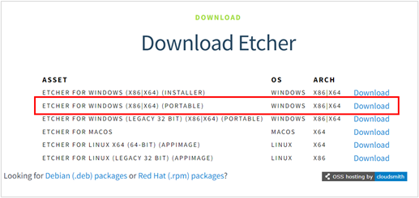
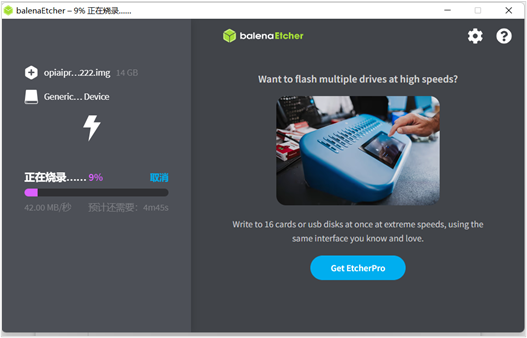
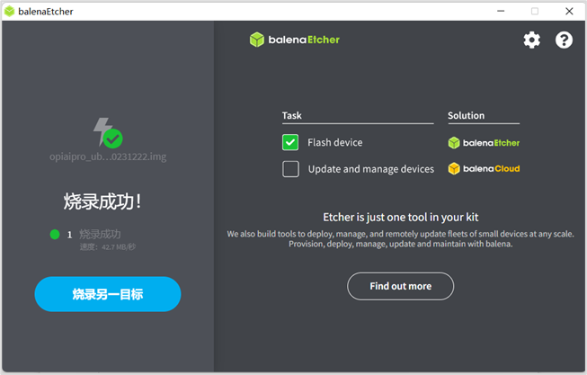

# 昇思MindSpore香橙派能力介绍
- 开发友好：动态图易用性提升，类huggingface风格降低开发调试门槛
- 性能提升：mindspore.jit编译成图，一行代码实现推理性能提升一倍
- 全流程支持：在香橙派上支持模型训推全流程

# 最新动态

目前我们在镜像中预装了Jupyter Lab软件。已实现[OrangePi AIpro（香橙派）开发板的系统镜像](http://www.orangepi.cn/html/hardWare/computerAndMicrocontrollers/service-and-support/Orange-Pi-AIpro.html)预置和[昇思MindSpore AI框架](https://www.mindspore.cn/install/)，并在后续版本迭代中持续演进，当前已支持MindSpore官网教程涵盖的全部网络模型。

# 支持的模型和版本兼容

| 模型名 | 支持CANN版本 | 支持Mindspore版本 | 支持的香橙派开发板型号 |
| :----- |:----- |:----- |:-----|
| [ResNet50](https://github.com/mindspore-courses/orange-pi-mindspore/tree/master/Online/inference/02-ResNet50) | 8.1.RC1  | 2.6.0| 8T8G |
|[ViT](https://github.com/mindspore-courses/orange-pi-mindspore/tree/master/Online/inference/03-ViT)| 8.0.RC3.alpha002  | 2.4.10| 8T16G |
|[FCN](https://github.com/mindspore-courses/orange-pi-mindspore/tree/master/Online/inference/04-FCN)| 8.0.RC3.alpha002  | 2.4.10| 8T16G |
|[ShuffleNet](https://github.com/mindspore-courses/orange-pi-mindspore/tree/master/Online/inference/05-ShuffleNet)| 8.0.RC3.alpha002  | 2.4.10| 8T16G |
|[SSD](https://github.com/mindspore-courses/orange-pi-mindspore/tree/master/Online/inference/06-SSD)|8.1.RC1  | 2.6.0| 8T8G |
|[RNN](https://github.com/mindspore-courses/orange-pi-mindspore/tree/master/Online/inference/07-RNN)|8.1.RC1  | 2.6.0| 8T8G |
|[LSTM+CRF](https://github.com/mindspore-courses/orange-pi-mindspore/tree/master/Online/inference/08-LSTM%2BCRF)|8.0.RC3.alpha002  | 2.4.10| 8T16G |
|[GAN](https://github.com/mindspore-courses/orange-pi-mindspore/tree/master/Online/inference/09-GAN)|8.0.RC3.alpha002  | 2.4.10| 8T16G |
|[DCGAN](https://github.com/mindspore-courses/orange-pi-mindspore/tree/master/Online/inference/10-DCGAN)|8.1.RC1  | 2.6.0| 8T8G |
|[Pix2Pix](https://github.com/mindspore-courses/orange-pi-mindspore/tree/master/Online/inference/11-Pix2Pix)|8.0.RC3.alpha002  | 2.4.10| 8T16G |
|[Diffusion](https://github.com/mindspore-courses/orange-pi-mindspore/tree/master/Online/inference/12-Diffusion)|8.0.RC3.alpha002  | 2.4.10| 8T16G |
|[ResNet50_transfer](https://github.com/mindspore-courses/orange-pi-mindspore/tree/master/Online/inference/13-ResNet50_transfer)|8.0.RC3.alpha002  | 2.4.10| 8T16G |
|[Qwen1.5-0.5b](https://github.com/mindspore-courses/orange-pi-mindspore/tree/master/Online/inference/14-qwen1.5-0.5b)|8.0.RC3.alpha002  | 2.4.10| 8T16G |
|[TinyLlama-1.1B](https://github.com/mindspore-courses/orange-pi-mindspore/tree/master/Online/inference/15-tinyllama)|8.0.RC3.alpha002  | 2.4.10| 8T16G |
|[DctNet](https://github.com/mindspore-courses/orange-pi-mindspore/tree/master/Online/inference/16-DctNet)  |8.0.RC3.alpha002  | 2.4.10| 8T16G |
|[DeepSeek-R1-Distill-Qwen-1.5B](https://github.com/mindspore-courses/orange-pi-mindspore/tree/master/Online/inference/17-DeepSeek-R1-Distill-Qwen-1.5B)  |8.0.RC3.alpha002/8.0.0.beta1/8.1.RC1.beta1  | 2.4.10/2.5.0/2.6.0| 20T24G |
|[DeepSeek-Janus-Pro-1B](https://github.com/mindspore-courses/orange-pi-mindspore/tree/master/Online/inference/18-DeepSeek-Janus-Pro-1B) | 8.0.RC3.alpha002/8.0.0beta1 | 2.4.10/2.5.0| 20T24G |
|[MiniCPM3-4B](https://github.com/mindspore-courses/orange-pi-mindspore/tree/master/Online/inference/19-MiniCPM3) | 8.0.0beta1 | 2.5.0| 20T24G |


# 指导文档
## 环境搭建指南

[](https://gitee.com/mindspore/docs/blob/master/docs/mindspore/source_zh_cn/orange_pi/environment_setup.md)

本章节将介绍如何在OrangePi AIpro上烧录镜像，自定义安装CANN和MindSpore，并配置运行环境。

### 1. 镜像烧录（以Windows系统为例）

镜像烧录可以在任何操作系统内执行，这里将以在Windows系统为例，演示使用相应版本的balenaEtcher工具，快速烧录镜像至您的Micro SD卡。

#### 1.1 制卡前准备

步骤1 将Micro SD卡插入读卡器，并将读卡器插入PC。


#### 1.2 下载Ubuntu镜像

步骤1 点击[此链接](http://www.orangepi.cn/html/hardWare/computerAndMicrocontrollers/service-and-support/Orange-Pi-AIpro.html)进入镜像下载页面。

> 此处仅做示意，不同算力开发板镜像下载地址不同，详细请查看[此链接](http://www.orangepi.cn/html/hardWare/computerAndMicrocontrollers/details/Orange-Pi-AIpro(20T).html)。

步骤2 点击图片中箭头图标跳转百度网盘下载页面。


步骤3 选择桌面版本下载，建议下载0318版本环境。


步骤4 备选下载方式。

如果百度网盘下载过慢，可以使用[此链接](https://obs-9be7.obs.cn-east-2.myhuaweicloud.com/OrangePi/20240318/opiaipro_ubuntu22.04_desktop_aarch64_20240318.img.xz)直接下载。

#### 1.3 下载制卡工具

有两种制卡工具balenaEtcher、Rufus，可根据自己电脑情况任选一种工具进行烧录。

- balenaEtcher制卡工具：

  步骤1 下载balenaEtcher。

  点击[此链接](https://etcher.balena.io/)可跳转到软件官网，点击绿色的下载按钮会跳到软件下载的地方。

  

  步骤2 选择下载 Portable版本。

  Portable版本无需安装，双击打开即可使用。

  

  步骤3 备选下载方式。

  如果官方网站下载过慢，可以使用以[此链接](https://obs-9be7.obs.cn-east-2.myhuaweicloud.com/OrangePi/balenaEtcher/balenaEtcher-Setup-1.18.4.exe )直接下载balenaEtcher-Setup-1.18.4软件。

  步骤4 打开balenaEtcher。

  

  

- Rufus制卡工具：

  步骤1 Rufus下载。

  点击[此链接](https://github.com/pbatard/rufus/releases/download/v4.5/rufus-4.5.exe)，进行下载、安装。

#### 1.4 选择和烧录镜像

这里介绍balenaEtcher、Rufus两种制卡工具烧录镜像，您可按对应工具进行烧录。

- balenaEtcher烧录镜像：

  步骤1 选择镜像、TF卡，启动烧录。

  1. 选择要烧录的镜像文件（上文1.2下载Ubuntu镜像的保存路径）。

  2. 选择TF卡的盘符。

  3. 点击开始烧录，如下图：

  

  烧录和验证大概需要20分钟左右，请耐心等待：

  

  

  步骤2 烧录完成。

  烧录完成后，balenaEtcher的显示界面如下图所示，如果显示绿色的指示图标说明镜像烧录成功，此时就可以退出balenaEtcher，拔出TF卡，插入到开发板的TF卡槽中使用：

  

- Rufus烧录镜像：

  步骤1 选择镜像、TF卡，烧录镜像。

  sd卡插入读卡器，读卡器插入电脑、选择镜像与sd卡，点击“开始”。

  

  步骤2 烧录完成。

  等待结束后直接拔出读卡器。

  

### 2. CANN升级

#### 2.1 Toolkit升级

步骤1 打开终端，切换root用户。

使用`CTRL+ALT+T`快捷键或点击页面下方带有`$_`的图标打开终端。


切换root用户，root用户密码：Mind@123。

```bash

# 打开开发板的一个终端，运行如下命令

(base) HwHiAiUser@orangepiaipro:~$ su – root
 Password:
(base) root@orangepiaipro: ~#

```

步骤2 删除镜像中已安装CANN包释放磁盘空间，防止安装新的CANN包时报错磁盘空间不足。

```bash

(base) root@orangepiaipro: ~# cd /usr/local/Ascend/ascend-toolkit
(base) root@orangepiaipro: /usr/local/Ascend/ascend-toolkit # rm -rf *

```

步骤3 打开昇腾CANN官网访问社区版资源[下载地址](https://www.hiascend.com/developer/download/community/result?module=cann)，下载所需版本的toolkit包，该处以8.0.RC3.alpha002版本aarch64架构为例（14和15两个案例仅在此版本上验证通过），如下图：


步骤4 进入Toolkit包下载目录。

```bash
(base) root@orangepiaipro: /usr/local/Ascend/ascend-toolkit# cd /home/HwHiAiUser/Downloads
```

> Orange Pi AI Pro浏览器文件默认下载目录：/home/HwHiAiUser/Downloads，用户在更换保存路径时请同步修改上述命令中的路径。

步骤5 给CANN包添加执行权限。

```bash
(base) root@orangepiaipro: /home/HwHiAiUser/Downloads# chmod +x ./Ascend-cann-toolkit_8.0.RC3.alpha002_linux-aarch64.run
```

步骤6 执行以下命令升级软件。

```bash
(base) root@orangepiaipro: /home/HwHiAiUser/Downloads#./Ascend-cann-toolkit_8.0.RC3.alpha002_linux-aarch64.run --install --quiet
```

升级完成后，若显示如下信息，则说明软件升级成功：

```bash
xxx install success

```

- xxx表示升级的实际软件包名。

- 安装升级后的路径（以root用户默认安装升级路径为例）：“/usr/local/Ascend/ ascend-toolkit/

步骤7 配置并加载环境变量。

```bash

(base) root@orangepiaipro: /home/HwHiAiUser/Downloads # echo “source /usr/local/Ascend/ascend-toolkit/set_env.sh” >> ~/.bashrc
(base) root@orangepiaipro: /home/HwHiAiUser/Downloads # source ~/.bashrc

```

#### 2.2 Kernels升级

> 二进制算子包Kernels依赖CANN软件包Toolkit，执行升级时，当前环境需已安装配套版本的Toolkit，并使用同一用户安装。

步骤1 打开终端，并切换root用户。

root用户密码：Mind@123。

```bash

# 打开开发板的一个终端，运行如下命令

(base) HwHiAiUser@orangepiaipro:~$ su – root
 Password:
(base) root@orangepiaipro: ~#

```

步骤2 执行如下命令，获取开发板NPU型号。

```bash
npu-smi info
```

步骤3 打开昇腾CANN官网访问社区版资源[下载地址](https://www.hiascend.com/developer/download/community/result?module=cann)，下载与CANN包版本一致，并且匹配NPU型号的kernel包，如下图：


步骤4 进入Kernels包下载目录。

```bash
(base) root@orangepiaipro: /usr/local/Ascend/ascend-toolkit# cd /home/HwHiAiUser/Downloads
```

> Orange Pi AI Pro浏览器文件默认下载目录：/home/HwHiAiUser/Downloads

步骤5 给kernels包添加执行权限。

```bash
(base) root@orangepiaipro: /home/HwHiAiUser/Downloads# chmod +x ./Ascend-cann-kernels-310b_8.0.RC3.alpha002_linux.run
```

步骤6 执行以下命令升级软件。

```bash
(base) root@orangepiaipro: /home/HwHiAiUser/Downloads#./Ascend-cann-kernels-310b_8.0.RC3.alpha002_linux.run --install
```

升级完成后，若显示如下信息，则说明软件升级成功：

```bash
xxx install success
```

- xxx表示升级的实际软件包名。

- 安装升级后的路径（以root用户默认安装升级路径为例）：“/usr/local/Ascend/ ascend-toolkit/latest/opp/built-in/op_impl/ai_core/tbe/kernel”。

### 3. MindSpore升级

#### 3.1 安装官网正式版（以MindSpore2.4.0为例）
当前2.3.1版本存在可用内存必须大于总内存的50%才能启动推理程序的限制，这一限制在2.4.0版本中被移除。

参考[昇思MindSpore官网安装教程](https://www.mindspore.cn/install) 安装。

```bash

pip install https://ms-release.obs.cn-north-4.myhuaweicloud.com/2.3.1/MindSpore/unified/aarch64/mindspore-2.3.1-cp39-cp39-linux_aarch64.whl --trusted-host ms-release.obs.cn-north-4.myhuaweicloud.com -i https://pypi.tuna.tsinghua.edu.cn/simple

# 注意确认操作系统和编程语言，香橙派开发板默认环境下是linux-aarch64和python3.9

```

#### 3.2 安装MindSpore daily包（以9月11日daily包为例）

香橙派开发板支持自定义安装MindSpore daily包，可从[此链接](https://repo.mindspore.cn/mindspore/mindspore/version/)获取到对应日期的软件包。

- 目标 daily whl包具体查找过程如下：

  1. 进入以master为前缀的目录。若是出现多个目录前缀是master时，推荐进入日期更靠后的目录。

  2. 进入unified目录。

  3. 根据实际操作系统信息，进入对应目录。由于香橙派开发板默认操作系统为linux-aarch64，所以进入aarch64目录。

  4. 根据实际python版本信息，找到对应daily whl包。由于香橙派开发板默认为python3.9，所以目标daily包为mindspore-2.4.0-cp39-cp39-linux_aarch64.whl。

  

> 本教程旨在让开发者体验到最新的版本特定，但由于daily包并不是正式发布版本，在运行中可能会出现一些问题，开发者可通过[社区](https://gitee.com/mindspore/mindspore)提交issue，或可自行修改并提交PR。

- 下载whl包进行安装，终端运行如下命令。

```bash

# wget下载whl包
wget https://repo.mindspore.cn/mindspore/mindspore/version/202409/20240911/master_20240911160029_917adc670d5f93049d35d6c3ab4ac6aa2339a74b_newest/unified/aarch64/mindspore-2.4.0-cp39-cp39-linux_aarch64.whl

# 在终端进入到whl包所在路径，再运行pip install命令进行安装
pip install mindspore-2.4.0-cp39-cp39-linux_aarch64.whl

```
**注：目前镜像（预计于24年第四季度发布）已内置MindSpore2.4版本，部分案例仅支持MindSpore 2.4版本运行，推荐开发者使用最新镜像。**

## 模型在线推理

本章节将介绍如何在OrangePi AIpro（下称：香橙派开发板）下载昇思MindSpore在线推理案例，并启动Jupyter Lab界面执行推理。

### 1. 下载案例

步骤1 下载案例代码。

```bash
# 打开开发板的一个终端，运行如下命令
cd samples/notebooks/
git clone https://github.com/mindspore-courses/orange-pi-mindspore.git
```

步骤2 进入案例目录。

下载的代码包在香橙派开发板的如下目录中：/home/HwHiAiUser/samples/notebooks。

项目目录如下：

```bash
/home/HwHiAiUser/samples/notebooks/orange-pi-mindspore/Online/inference
01-quick_start
02-ResNet50
03-ViT
04-FCN
05-Shufflenet
06-SSD
07-RNN
08-LSTM+CRF
09-GAN
10-DCGAN
11-Pix2Pix
12-Diffusion  
13-ResNet50_transfer
14-qwen1.5-0.5b
15-tinyllama
16-DctNet
17-DeepSeek-R1-Distill-Qwen-1.5B
18-DeepSeek-Janus-Pro-1B
19-MiniCPM3
```

### 2. 推理执行（案例01-13）

步骤1 启动Jupyter Lab界面。

```bash
cd /home/HwHiAiUser/orange-pi-mindspore/ 
./start_notebook.sh
```

在执行该脚本后，终端会出现如下打印信息，在打印信息中会有登录Jupyter Lab的网址链接。


然后打开浏览器。


再在浏览器中输入上面看到的网址链接，就可以登录Jupyter Lab软件了。


步骤2 在Jupyter Lab界面双击下图所示的案例目录，此处以“04-FCN”为例，即可进入到该案例的目录中。


步骤3 在该目录下有运行该示例的所有资源，其中mindspore_fcn8s.ipynb是在Jupyter Lab中运行该样例的文件，双击打开mindspore_fcn8s.ipynb，在右侧窗口中会显示。mindspore_fcn8s.ipynb文件中的内容，如下图所示：


步骤4 单击⏩按钮运行样例，在弹出的对话框中单击“Restart”按钮，此时该样例开始运行。


**注：如遇报错“线程同步失败”，请尝试关闭swap。执行sudo swapoff /swapfile命令。**

### 3. 推理执行（案例14、15）
**注：此处推荐使用aipro20T 24G版本，aipro8T 16G也可运行，但请注意剩余内存。暂不支持小于16G内存的aipro运行这两个案例。**

步骤1 进入案例目录，以14-qwen1.5-0.5b为例，15号案例类似。

```bash
cd /home/HwHiAiUser/orange-pi-mindspore/Online/inference/14-qwen1.5-0.5b
```

**注：首次启动时会自动从镜像站下载模型，如遇网络原因无法下载，可以通过电脑下载后上传到案例目录下的.mindnlp文件夹内的对应目录下。**

步骤2 将模型路径修改为本地模型存放的路径（可选）

```bash
vim qwen1.5-0.5b.py
# 找到以下两行
tokenizer = AutoTokenizer.from_pretrained("Qwen/Qwen1.5-0.5B-Chat", ms_dtype=mindspore.float16)
model = AutoModelForCausalLM.from_pretrained("Qwen/Qwen1.5-0.5B-Chat", ms_dtype=mindspore.float16)
# 修改为
tokenizer = AutoTokenizer.from_pretrained("/home/HwHiAiUser/orange-pi-mindspore-master/Online/inference/14-qwen1.5-0.5b/.mindnlp/model/Qwen/Qwen1.5-0.5B-Chat", ms_dtype=mindspore.float16)
model = AutoModelForCausalLM.from_pretrained("/home/HwHiAiUser/orange-pi-mindspore-master/Online/inference/14-qwen1.5-0.5b/.mindnlp/model/Qwen/Qwen1.5-0.5B-Chat", ms_dtype=mindspore.float16)
```

步骤3 启动推理程序

```bash
python3 qwen1.5-0.5b.py
```
