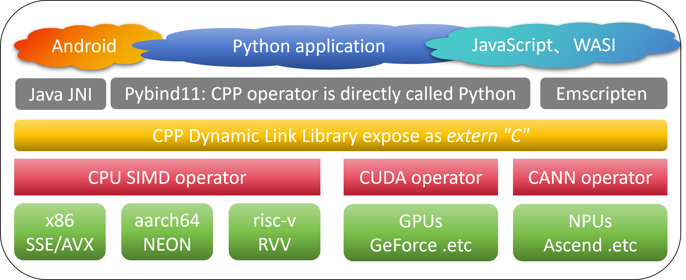

[chinese](./README.zh.md)|English 

# Operator development template for Heterogeneous Computing Systems

> Here is a sample code for Pybind11 to bind CPU and Ascend C operator to Xiangcheng Pi, for details [the user guide](https://www.bilibili.com/video/BV1hrMtzqERU).

The development path of parallel acceleration of high-performance computing is similar. Taking Huawei as an example, first there is Ascend NPU hardware, then there is C language encapsulation ccec (Cube-based Computing Engine C) with corresponding assembly instructions, and then a layer of Ascend C abstraction is applied to shield the underlying hardware differences. Bi Sheng originally defined an MLIR dialect adaptation based on LLVM [Ascend NPU IR](https://gitee.com/ascend/ascendnpu-ir) it's a wishful return. Huawei Bisheng compiler is doing similar [AscendNPU IR supports tri-party ecological access such as Triton and FlagTree, and provides three major categories of advanced OPs, including handling, computing and memory.](https://www.bilibili.com/video/BV1NCTsz1EwK/).

|Architecture|Compilation|Compiler|Debugging and debugging tools|Intermediate representation language|
|------|---------|--------------|----------------------|----------------------|
|CPU|asm|gcc|IDE|LLVM|
|GPU|ptx|nvcc|cuda-gdb & Insight|[MLIR dialect for GPU](https://mlir.llvm.org/docs/Dialects/GPU/)|
|NPU|bin|ccec bisheng|msdebug & MindStudio|Ascend NPU IR|

 [This project](https://github.com/Tridu33/OperatorsDevTemplate/tree/main) use the most basic TensorAdd as an example to introduce the operator development call process of "Python is not skinned, C++ is winged". More operators first consider the existing operators that do not modify the templates or even rewrite them according to the algorithm:

- - CPU,[More CPU quantization operator reference llamafile](https://github.com/Mozilla-Ocho/llamafile/tree/main/llama.cpp), you need to know the usage of the AVX instruction set of x86 and the usage of the NEON instruction set of arm64;
- - CUDA.cu for GPU,[More GPU inference operator reference CUDA official samples](https://github.com/NVIDIA/cuda-samples/tree/master/Samples),[Teacher Fan Zheyong's book "CUDA-Programming Programming"](https://github.com/brucefan1983/CUDA-Programming) and [CUDA_kernel_Samples](https://github.com/Tongkaio/CUDA_Kernel_Samples) similar case sets, you need to understand parallel development of CUDA and pyCUDA;
- - Ascend NPU,[More examples of NPU inference operator reference official solutions](https://github.com/Ascend/samples/tree/master/cplusplus/level1_single_api/4_op_dev/1_custom_op) and [Old Tan taking off at Station B](https://space.bilibili.com/668461244?spm_id_from=333.337.0.0) for information such as TBE, pyACL, OMl quantitative inference operator library, etc., you need to know the pre-knowledge of Ascend systems, and find it on demand or rewritten it yourself.[Teacher Su Tonghua's book "AscendC Heterogeneous Programming-Ascend Operator Design Guide" with the book code and PPT](https://box.lenovo.com/l/8uf9SX). There are several ways to develop CANN operators: TBE DSL, TBE TIK, AI CPU and **Ascend C**.For newly developed operators, only the latest Ascend C is recommended. Before developing code, you need to first choose the appropriate operator implementation method. You need to query before developing or migrating operators [AI framework operator list and CANN operator list](https://www.hiascend.com/document/detail/zh/canncommercial/80RC1/apiref/operatorlist/operatorlist_0000.html) 
Wait for ascend operator family bucket: https://gitee.com/ascend/cann-hccl,
https://gitee.com/ascend/ascendc-api-adv,
https://gitee.com/ascend/cann-ops,
https://gitee.com/ascend/cann-ops-adv,
https://gitee.com/ascend/catlass,
https://gitee.com/ascend/ascend-transformer-boost,
https://gitee.com/ascend/samples .

- - 其他语言实现的算子:图灵完备的编程语言能实现的算法能力是一样的,一般HPC为适配硬件高性能计算,常采用cpp实现算子.原生python写的算子不需要pybind11,Triton最初是CUDA更简易用法的封装后来成为一种中间表示,[Triton official tutorials](https://github.com/triton-lang/triton/blob/main/python/tutorials/01-vector-add.py) and [Awesome-Triton-Kernels](https://github.com/zinccat/Awesome-Triton-Kernels), scientific computing will also consider it [Implement operators with Julia](https://www.mindspore.cn/tutorials/zh-CN/r2.6.0/custom_program/operation/op_custom_julia.html). JAX is an experimental field of AI frameworks for autograd+XLA in pure function differential programming. It exists in analogy to PyTorch, MindSpore, Tensorflow, etc. The FP programming philosophy lies in the flexibility of composability, such as [cuda+cpp write operator pybind11 encapsulates an operator to call](https://jax.ac.cn/en/latest/Custom_Operation_for_GPUs.html).

## Python AI framework and underlying operators are decoupled

1. CopyIn task: input H2D pointer is passed to the underlying heterogeneous operator;
2. Compute tasks: Automatic (the mainstream practice of inference engines such as llama.cpp is to automatically select the backend based on availability) or manually (ktransformers use yaml to manually specify the specific structure of MoE to heterogeneous devices) to assign tasks in the dispatch calculation diagram to the specific operator of heterogeneous computing structure.so;
3. CopyOut: Task: Finally, return the calculation result to the Python caller through D2H;

This project first introduces how pybind11 calls cpp and debug it; then introduces how cuda and cpp operators are bound and used on GPU machines; then introduces the introduction to the development of AscendNPU operators. similar [The theory of MindSpore first registering an operator interface and then dispatching it to CPU, GPU, and NPU multi-end implementation using similar methods.](https://github.com/openmlsys/openmlsys-zh/blob/main/chapter_programming_interface/c_python_interaction.md) the specific practical code for the actual development steps can be used as reference [Tutorial on the official website’s custom operator](https://www.mindspore.cn/docs/zh-CN/r2.5.0/model_train/custom_program/op_custom.html):

- Operator primitive registration = declare an interface behavior description, which is connected to various backends of CPU, GPU, and NPU
- Writing GPU/CPU/Ascend NPU operator
- Register operator pybind11 binding function

## "Now is fantasy time" 
The main thing that so/dll cross-language calls is IO data type mapping conversion: pybind11 maps common cpp STL data structure to numpy, etc. JNI exposes so to Android Java mobilization. Similarly, the Pybind11 framework is to map data types and pass IO data.
  

>OrangePi launches AI Studio Pro training and promotion integrated artificial intelligence computing power card. It has 352TOPS computing power and will support Windows systems. OrangePi AI Studio Pro adopts Ascend AI technology route, integrating "ARM core, Al core, Vector core, Image core" into one, providing "basic universal computing power + super AI computing power + codec core", which can meet the needs of integrated training and promotion integrated AI tasks. It has 96GB / 192GB LPDDR4X, and a speed of 4266Mbps. Taobao’s non-Pro version is 48G, that is, the 4 device specifications are multiples of 48G, 48G  96G, 196G. The highest specification may be the dual-slot 300I DUO, that is, 4 300I, each 48G.

The AI ​​Studio Pro is probably used to make the USB4 docking station to take into account the compatibility of multiple platforms and scalability in the future, and then use the lightning port to achieve multi-machine scalability, which can be used for Linux win macos. SPIR-V is an intermediate language shared by multiple Khronos APIs, including Vulkan, OpenGL, and OpenCL. If an intermediate representation language that complies with the SPIR-V standard is abstracted on the Ascend NPU, it can then be bound to ffmpeg.js or webGL to create a webGPU-like effect and bind it to cloud-native applications. Will one day, when my PC USB is plugged in OrangePi AI Studio Pro and check the background to display "Unre Real Engine embedded in QQ is using NPU for parallel accelerated computing image rendering"?